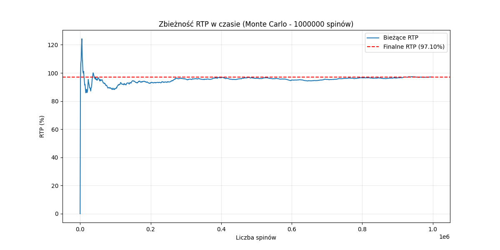
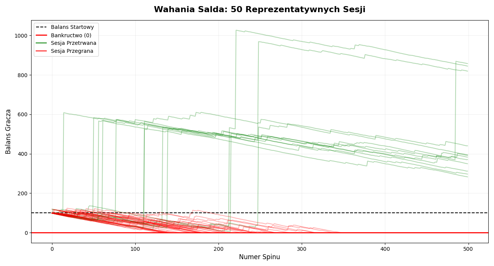
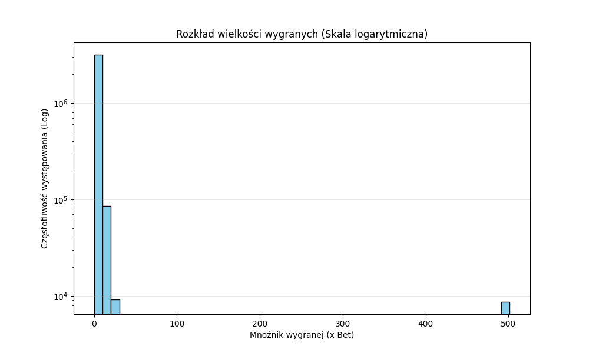
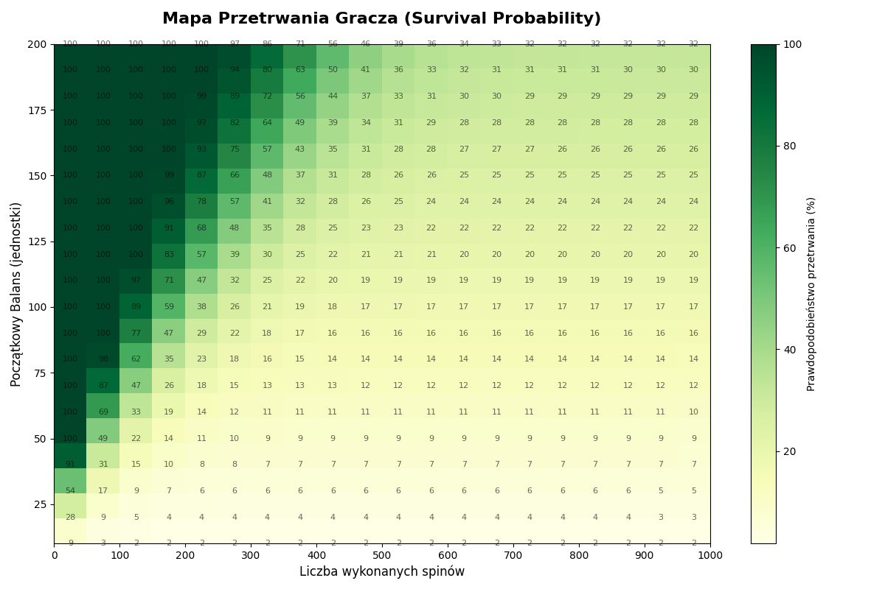

# High-Performance Slot Math Engine & Monte Carlo Simulator

Profesjonalny silnik matematyczny dla gry typu slot (3x3), zoptymalizowany pod kątem wydajności przy użyciu biblioteki **NumPy**. Projekt zawiera pełny symulator statystyczny metodą Monte Carlo, pozwalający na walidację parametrów gry na dużych próbach danych.

## Kluczowe cechy
- **Wektoryzacja Obliczeń:** Wykorzystanie NumPy do przetwarzania milionów spinów.
- **Analiza Statystyczna:** Automatyczne wyliczanie kluczowych wskaźników KPI (RTP, Hit Frequency, Volatility Index).
- **Wizualizacja Danych:** Generowanie wykresów zbieżności statystycznej przy użyciu Matplotlib.
- **Logika Wilda:** Pełna obsługa symbolu Wild zastępującego inne symbole na liniach wygrywających.

## Wyniki Symulacji (Próba: 100 000 000 spinów)

Poniższa tabela przedstawia uśrednione wyniki uzyskane podczas walidacji silnika.

| Parametr | Wartość | Opis |
| :--- | :--- | :--- |
| **RTP (Return to Player)** | **97.58%** | Teoretyczny zwrot dla gracza |
| **Hit Frequency** | **32.75%** | Częstotliwość występowania jakiejkolwiek wygranej |
| **Standard Deviation** | **14.8451** | Odchylenie standardowe pojedynczego spinu |
| **Volatility Index** | **29.10** | Wskaźnik zmienności (95% Confidence Interval) |

### Zbieżność RTP (Monte Carlo)
Wykres poniżej udowadnia stabilność modelu matematycznego. Wraz ze wzrostem liczby spinów, wynik symulacji zbiega się do teoretycznego poziomu RTP, co potwierdza poprawność implementacji Prawa Wielkich Liczb.



## Symulacja sesji gracza (Analiza Monte Carlo)

W celu oceny gry z perspektywy użytkownika, przeprowadzono analizę sesji metodą Monte Carlo. Podczas gdy teoretyczne wskaźniki RTP i Volatility Index opisują zachowanie automatu w nieskończonym horyzoncie czasowym, analiza sesji pozwala zrozumieć realne ryzyko utraty kapitału (prawdopodobieństwo bankructwa).

#### Parametry symulacji:
- **Liczba sesji:** 1 000
- **Limit spinów w sesji:** 500
- **Balans początkowy:** 100 jednostek
- **Stawka (Bet):** 1 jednostka
- **Profil matematyczny:** Wysoka zmienność (VI ≈ 28.97)

#### Kluczowe wnioski:
- **Prawdopodobieństwo bankructwa:** 82,80% – taki odsetek graczy traci cały budżet przed wykonaniem 500 spinów.
- **Średnia długość sesji:** 265,3 spinów.
- **Mediana długości sesji:** 219,5 spinów. 
- **Interpretacja:** Różnica między medianą a średnią wskazuje na silną asymetrię rozkładu. Większość graczy kończy sesję stosunkowo szybko, natomiast średnia jest zawyżana przez nieliczne sesje o wyjątkowo długim czasie trwania, wynikającym z trafienia wysokich wygranych.

#### Wizualizacja wahań kapitału (Balance Swings):


Powyższy wykres prezentuje 50 reprezentatywnych sesji:
- **Czerwone linie** oznaczają sesje zakończone bankructwem.
- **Zielone linie** reprezentują sesje, w których gracz przetrwał 500 spinów.
- **Gwałtowne skoki** na trajektoriach zielonych linii obrazują trafienia wysokopłatnych kombinacji (np. H1 lub symbole Wild). 
- **Systematyczny spadek** większości linii dokumentuje wpływ "House Edge" oraz kosztu gry, który przy braku trafienia wysokiej wygranej szybko pochłania pieniądze z konta przy tak wysokiej zmienności.

Analiza potwierdza, że model matematyczny poprawnie implementuje profil "High Volatility", oferując rzadkie, ale znaczące wygrane kosztem krótszego średniego czasu rozgrywki dla większości użytkowników.

## Rozkład wygranych 

Poniższy histogram przedstawia rozkład wielkości wygranych w skali logarytmicznej. Skala ta została zastosowana, aby uwidocznić rzadkie zdarzenia o wysokiej wartości, które przy skali liniowej byłyby niemożliwe do zaobserwowania obok dominujących małych wypłat.



**Wnioski z analizy rozkładu:**
* **Bimodalny charakter:** Wyraźna przerwa w rozkładzie (tzw. gap) między mnożnikami średnimi a maksymalnymi potwierdza profil gry typu **High Volatility**.
* **Koncentracja wypłat:** Większość zwycięskich spinów (Hit Frequency = 32.75%) dostarcza wypłaty w przedziale 1x-20x stawki, co zapewnia częstą interakcję, podczas gdy potencjał wygranej (Max Win) jest skoncentrowany w rzadkim zdarzeniu o mnożniku 500x.
* **Wpływ na Volatility Index:** To właśnie ta dysproporcja między częstymi małymi wygranymi a rzadką wygraną 500x generuje wysoki współczynnik zmienności (VI ≈ 28.97).


## Mapa cieplna prawdopodobieństwa przetrwania

W celu pełnej charakterystyki modelu, wdrożono analizę przetrwania opartą na 10 000 niezależnych sesji
dla różnych kapitałów początkowych.
Pozwala to na precyzyjne określenie ryzyka bankructwa w zależności od czasu trwania sesji oraz dostępnego budżetu.



#### Kluczowe aspekty analizy:
- **Oś Y (Początkowy Balans):** Reprezentuje liczbę jednostek, z którymi gracz rozpoczyna sesję.
- **Oś X (Liczba spinów):** Czas trwania sesji mierzony liczbą rozgrywek.
- **Skala kolorystyczna:** Prawdopodobieństwo (%), że gracz **nie zbankrutuje** w danym punkcie czasu.

#### Wnioski:
- **Deterministyczna strefa bezpieczeństwa:** Przy balansie 100 jednostek gracz posiada matematyczną gwarancję przetrwania pierwszych 100 spinów. Wynika to z faktu, że przy stawce 1 unit/spin bankructwo przed setnym rozegraniem jest niemożliwe nawet przy skrajnie niekorzystnym przebiegu sesji.
- **Efekt "Ściany":** Gwałtowny spadek szansy na przetrwanie dla balansu 100 następuje między 100. a 200. spinem (spadek z **89%** do **38%**). Obrazuje to agresywny charakter drenażu kapitału – model dokonuje błyskawicznej selekcji graczy, eliminując tych, którzy w początkowej fazie nie trafili wysokopłatnej kombinacji.
- **Agresywność modelu:** Przy niskim kapitale (poniżej 50 jednostek) szansa na przetrwanie 150 spinów wynosi tylko ok. **15%**, co potwierdza ekstremalnie wysoką zmienność silnika.
- **Stabilizacja sesji:** Interesującym zjawiskiem jest stabilizacja prawdopodobieństwa przetrwania powyżej 600. spinu (np. utrzymanie poziomu ok. 30-32% dla balansu 200). Sugeruje to, że gracze, którzy przetrwali fazę początkową, trafili wygrane o wysokim mnożniku, co statystycznie "ubezpieczyło" ich portfel na resztę symulacji.
- **Liniowa skalowalność ryzyka (Long-term):** Analiza końcowej fazy sesji (1000 spinów) wykazuje niemal idealnie liniową korelację między kapitałem startowym a szansą na przetrwanie (wzrost szans o ok. 2x przy każdorazowym podwojeniu budżetu). Świadczy to o stabilnej zmienności modelu.


## Technologia
- **Python 3.x**
- **NumPy** - macierzowe operacje na danych
- **Matplotlib** - generowanie wykresów analitycznych

## Struktura Projektu
- `numpy_simulation.py` - Główny silnik symulacji i moduł wizualizacji.
- `settings.py` - Definicja bębnów (Reel Strips), linii płatnych (Paylines) oraz tabeli wypłat (Paytable).
- `player_session.py` - Symulacje sesji, analiza prawdopodobieństwa bankructwa i wizualizacja rozkładu wygranych.

## Jak uruchomić
1. Sklonuj repozytorium:
   ```bash
   git clone [https://github.com/TwojUser/slot-math-engine.git](https://github.com/TwojUser/slot-math-engine.git)
